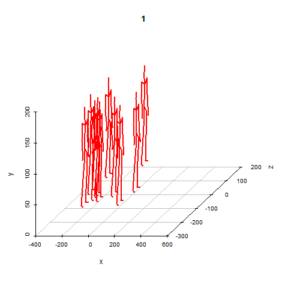

<!-- README.md is generated from README.Rmd. Please edit that file -->
This package holds functions to easily parse motion capture ("mocap") files. Currently only ASF/AMC files are supported, and only those found in the [Carnegie Mellon University Graphics Lab Motion Capture Database](http://mocap.cs.cmu.edu/) have been tested.

Install:

``` r
devtools::install_github("gsimchoni/mocap")
```

Load:

``` r
library(mocap)
```

Parse a ASF file:

``` r
asfFilePath <- system.file("extdata", "lambada.asf", package = "mocap")
asf <- readASF(asfFilePath)
```

Parse a AMC file:

``` r
amcFilePath <- system.file("extdata", "lambada.amc", package = "mocap")
amc <- readAMC(amcFilePath, asf)
```

Get Motion Data:

``` r
xyz <- getMotionData(asf, amc)
```

Make a GIF out of it (if you have the `scatterplot3d` and `animation` packages installed):

``` r
makeMotionMovie(asf, amc, xyz, skipNFrames = 4)
```


Animate a few skeletons from a single one:

``` r
asfFilePath <- system.file("extdata", "zombie.asf", package = "mocap")
asf <- readASF(asfFilePath)
amcFilePath <- system.file("extdata", "zombie.amc", package = "mocap")
amc <- readAMC(amcFilePath, asf)
xyz <- getMotionData(asf, amc)
makeMotionMovie(asf, amc, xyz, skipNFrames = 3, nSkeletons = 10, sdExtraSkeleton = 100)
```



Animate two *different* skeletons simultaneously:

``` r
asfFile <- system.file("extdata", "charleston.asf", package = "mocap")
asf <- readASF(asfFile)
amcFile1 <- system.file("extdata", "charleston1.amc", package = "mocap")
amc1 <- readAMC(amcFile1, asf)
amcFile2 <- system.file("extdata", "charleston2.amc", package = "mocap")
amc2 <- readAMC(amcFile2, asf)
xyz1 <- getMotionData(asf, amc1)
xyz2 <- getMotionData(asf, amc2)
makeMotionMovie(asf, amc1, xyz1, skipNFrames = 2,
                twoSkeletons = TRUE, amc2 = amc2, xyz2 = xyz2, viewAngle = 20)
```


More information and examples [here](http://giorasimchoni.com).
